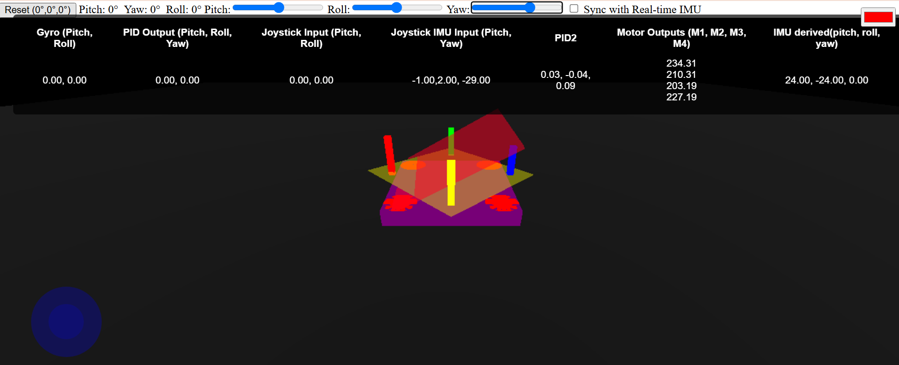
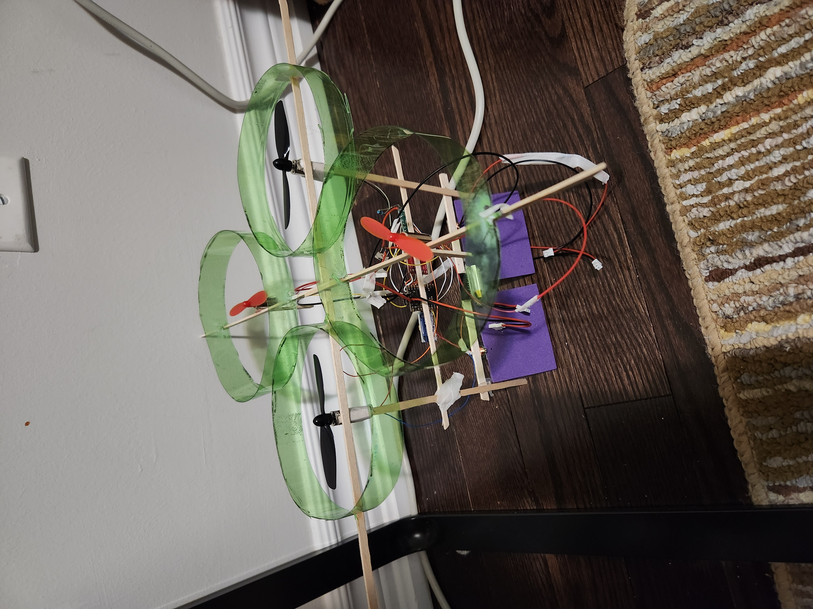
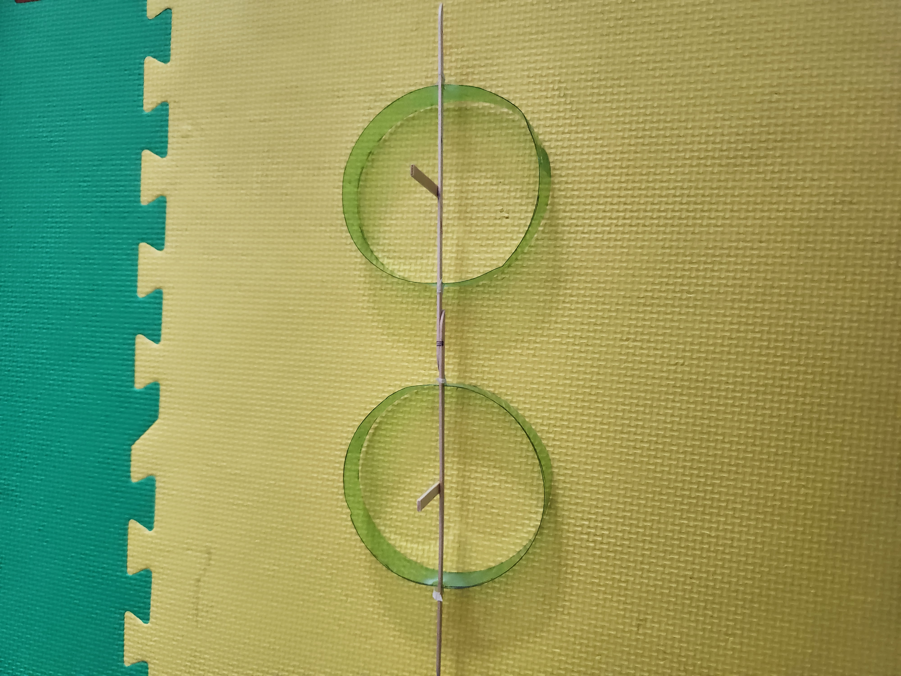

# ESP32-c6 Bi Copter

This project is a work in progress.

Inspired by Nicholas Drehm's project. Some of the code is also taken from there.

The Coreless 8520 motors are not strong enough, 2x coreless 8520 motors are not able to lift off.
I got a new 400mAh 40C batter will test to see if it lifts off or the si2300 MOSFETs will burns.

If it still does not work I will turn it into a quadcopter.

## Quad copter configuration
2x 8250 motors and 2x 716 motors. The 716 motors are mostly at front and back size so 8250s are in left and right. Idea was to get pitch control instead of servos of the bicopter. Also this will provide some lift as the 8250s were proving to have insufficient power. But after experiment even this configuration is not able to lift off. Theoretically this configuration should be able to lift off 70grams of weight.

## Drone Simulator
Added a dronesim folder, which is a threejs program to view motor calculated values done in javascripts reading original IMU values which can be input via 3 sliders. Alternately it can transmit IMU values from drone and calculate in simulator as well as in real drone and view the calculated motor values are matching. 
The whole reason I built this as I had doubts about the PID calculations and also it will help in visualizing the motor values compared to real IMU.
. Here red overlay is IMU input, and yellow layer represents motor force fields. Also there are vertical bars showing the motor force.
Run by `cd dronsim` then `npm install` and followed by `npm start`.

## Components
* esp32-c6 supermini
* drv8833 dual H-bridge for actuator control, I can use it for controlling motors as well if I convert it into quadcopter.
* Two si2300 MOSFETs for driving coreless motors.
* actuators again vertically hanging actuators are also not strong, I added 10Ohms Resistor for precaution of overcurrent. But even if I remove that I think it wont be strong. 
** Proven these motors are not strong enough even after adding two more 716 motors.
* TBD Two micro 2g servos
* TBD 1104 brushless motor with 1s battery 4A ESC. Actually some aliexpress pages say its 6A which would be ideal but others say its 4A so I am hoping it does 6A.

Weight - again no idea should be 40gram or so.

## Image

Some empty slots to convert to quad

### Updates
6/22/2025 - The added 716 motors areproviding insufficient lift. I tried with 40C 400mah battery still it did not work.